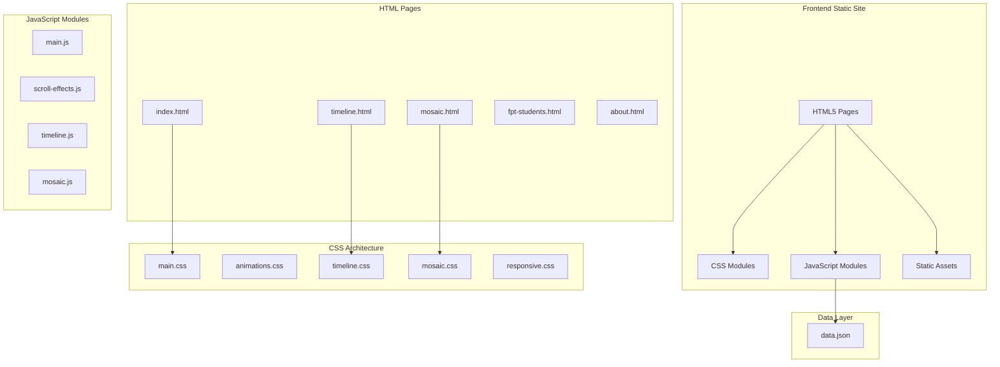

# Design Document: Vietnam Religious Diversity Landing Page

## Overview

Landing page multi-page về đa dạng tôn giáo Việt Nam được xây dựng với HTML5, CSS3 và JavaScript thuần. Website bao gồm 5 trang chính với các component tương tác như timeline, mosaic grid, accordion, carousel và modal. Thiết kế theo mobile-first approach, đảm bảo accessibility WCAG 2.1 AA và tối ưu performance.

### Design Goals
- Trải nghiệm người dùng mượt mà với animations scroll-triggered
- Responsive trên mọi thiết bị
- Accessible cho người dùng khuyết tật
- Performance tối ưu (Lighthouse > 90)
- Dễ bảo trì với cấu trúc modular

## Architecture



### File Structure

```
/
├── index.html
├── timeline.html
├── mosaic.html
├── fpt-students.html
├── about.html
├── css/
│   ├── main.css          # Base styles, typography, colors
│   ├── animations.css    # Keyframes, transitions
│   ├── timeline.css      # Timeline-specific styles
│   ├── mosaic.css        # Mosaic grid styles
│   └── responsive.css    # Media queries
├── js/
│   ├── main.js           # Navigation, utilities
│   ├── scroll-effects.js # Intersection Observer animations
│   ├── timeline.js       # Timeline interactions, modals
│   └── mosaic.js         # Mosaic hover effects
├── assets/
│   ├── images/
│   ├── icons/
│   └── data.json
├── vercel.json
└── README.md
```

## Components and Interfaces

### 1. Navigation Component

```javascript
// Interface: NavigationController
interface NavigationController {
  init(): void;
  toggleMobileMenu(): void;
  closeMobileMenu(): void;
  setActiveLink(path: string): void;
  handleKeyboardNav(event: KeyboardEvent): void;
}
```

**Behavior:**
- Sticky positioning với `position: sticky`
- Hamburger menu toggle trên mobile (< 768px)
- Active link highlighting dựa trên current URL
- Keyboard navigation với Tab, Enter, Space, Escape

### 2. Scroll Animation Controller

```javascript
// Interface: ScrollAnimationController
interface ScrollAnimationController {
  init(): void;
  observeElements(selector: string, options?: IntersectionObserverOptions): void;
  handleIntersection(entries: IntersectionObserverEntry[]): void;
  applyAnimation(element: HTMLElement, animationType: string): void;
}

interface IntersectionObserverOptions {
  threshold: number;
  rootMargin: string;
}
```

**Animation Types:**
- `fade-in`: Opacity 0 → 1
- `slide-up`: Transform translateY(30px) → 0
- `slide-left`: Transform translateX(-30px) → 0
- `slide-right`: Transform translateX(30px) → 0
- `scale-in`: Transform scale(0.9) → 1

### 3. Counter Animation Component

```javascript
// Interface: CounterAnimator
interface CounterAnimator {
  init(selector: string): void;
  animateCounter(element: HTMLElement, target: number, duration: number): void;
  easeOutQuad(t: number): number;
}
```

**Behavior:**
- Trigger khi element vào viewport
- Animate từ 0 đến target value
- Duration: 2000ms với easing function
- Format số với locale (dấu phẩy ngăn cách hàng nghìn)

### 4. Timeline Component

```javascript
// Interface: TimelineController
interface TimelineController {
  init(): void;
  renderTimeline(data: TimelinePeriod[]): void;
  openModal(periodId: string): void;
  closeModal(): void;
  updateProgressIndicator(): void;
  trapFocus(modal: HTMLElement): void;
}

interface TimelinePeriod {
  id: string;
  years: string;
  title: string;
  summary: string;
  details: string;
  image?: string;
}
```

**Layout:**
- Vertical zigzag: odd items left, even items right
- Central line với dots tại mỗi period
- Progress indicator dựa trên scroll position

### 5. Modal Component

```javascript
// Interface: ModalController
interface ModalController {
  open(content: ModalContent): void;
  close(): void;
  trapFocus(): void;
  handleKeydown(event: KeyboardEvent): void;
  returnFocus(): void;
}

interface ModalContent {
  title: string;
  body: string;
  image?: string;
}
```

**Accessibility:**
- Focus trap khi modal open
- Close với Escape key
- Return focus to trigger element
- aria-modal="true", role="dialog"

### 6. Mosaic Grid Component

```javascript
// Interface: MosaicController
interface MosaicController {
  init(): void;
  renderTiles(data: ReligionTile[]): void;
  handleTileHover(tile: HTMLElement): void;
  handleKeyboardNav(event: KeyboardEvent): void;
}

interface ReligionTile {
  id: string;
  name: string;
  color: string;
  icon: string;
  followers: string;
  description: string;
}
```

**Color Scheme:**
- Phật giáo: #FFD700 (Gold)
- Công giáo: #8B0000 (Dark Red)
- Tin Lành: #4169E1 (Royal Blue)
- Hồi giáo: #228B22 (Forest Green)
- Cao Đài: #FF6347 (Tomato)
- Hòa Hảo: #8B4513 (Saddle Brown)
- Tín ngưỡng dân gian: #9932CC (Dark Orchid)
- Không tôn giáo: #708090 (Slate Gray)

### 7. Accordion Component

```javascript
// Interface: AccordionController
interface AccordionController {
  init(container: HTMLElement): void;
  toggle(header: HTMLElement): void;
  expandAll(): void;
  collapseAll(): void;
  handleKeydown(event: KeyboardEvent): void;
}
```

**Behavior:**
- Single expand mode (collapse others when one opens)
- Smooth height transition
- Arrow key navigation between headers
- aria-expanded, aria-controls attributes

### 8. Carousel Component

```javascript
// Interface: CarouselController
interface CarouselController {
  init(container: HTMLElement): void;
  goToSlide(index: number): void;
  nextSlide(): void;
  prevSlide(): void;
  startAutoplay(interval: number): void;
  stopAutoplay(): void;
  handleKeydown(event: KeyboardEvent): void;
}
```

**Features:**
- Dot indicators
- Prev/Next buttons
- Auto-play với pause on hover
- Swipe support cho touch devices
- Keyboard navigation (Arrow keys)

### 9. Data Fetcher Utility

```javascript
// Interface: DataFetcher
interface DataFetcher {
  fetchData(url: string): Promise<SiteData>;
  handleError(error: Error): void;
  getFallbackData(): SiteData;
}

interface SiteData {
  timeline: TimelinePeriod[];
  religions: ReligionTile[];
  testimonials: Testimonial[];
  stats: StatItem[];
  principles: Principle[];
  guidelines: Guideline[];
}
```

## Data Models

### Timeline Period

```json
{
  "id": "period-1",
  "years": "1945-1954",
  "title": "Thời kỳ kháng chiến",
  "summary": "Chính sách đoàn kết tôn giáo trong kháng chiến chống Pháp",
  "details": "Chi tiết về chính sách...",
  "image": "assets/images/period-1.jpg"
}
```

### Religion Tile

```json
{
  "id": "buddhism",
  "name": "Phật giáo",
  "color": "#FFD700",
  "icon": "assets/icons/buddhism.svg",
  "followers": "14 triệu",
  "description": "Tôn giáo lớn nhất Việt Nam với lịch sử hơn 2000 năm"
}
```

### Testimonial

```json
{
  "id": "testimonial-1",
  "name": "Nguyễn Văn A",
  "major": "Công nghệ thông tin",
  "quote": "Môi trường FPT giúp tôi hiểu và tôn trọng sự đa dạng...",
  "avatar": "assets/images/avatar-1.jpg"
}
```

### Stat Item

```json
{
  "id": "stat-religions",
  "value": 16,
  "label": "Tôn giáo được công nhận",
  "suffix": ""
}
```

### Principle Card

```json
{
  "id": "respect",
  "title": "Tôn trọng",
  "icon": "assets/icons/respect.svg",
  "description": "Tôn trọng quyền tự do tín ngưỡng của mọi người"
}
```

### Guideline (Accordion)

```json
{
  "id": "guideline-1",
  "title": "Trong lớp học",
  "content": "Hướng dẫn cụ thể về cách ứng xử..."
}
```

### Complete data.json Structure

```json
{
  "site": {
    "title": "Đa Dạng Tôn Giáo Việt Nam",
    "description": "Landing page về đa dạng tôn giáo và chính sách tôn giáo Việt Nam"
  },
  "stats": [],
  "timeline": [],
  "religions": [],
  "principles": [],
  "guidelines": [],
  "testimonials": [],
  "references": []
}
```

## CSS Architecture

### Design Tokens

```css
:root {
  /* Colors */
  --color-primary: #667eea;
  --color-primary-dark: #764ba2;
  --color-text: #1a202c;
  --color-text-light: #718096;
  --color-background: #ffffff;
  --color-surface: #f7fafc;
  
  /* Typography */
  --font-heading: 'Playfair Display', serif;
  --font-body: 'Inter', sans-serif;
  --font-size-base: 16px;
  --font-size-sm: 14px;
  --font-size-lg: 18px;
  --font-size-xl: 24px;
  --font-size-2xl: 32px;
  --font-size-3xl: 48px;
  
  /* Spacing */
  --spacing-xs: 4px;
  --spacing-sm: 8px;
  --spacing-md: 16px;
  --spacing-lg: 24px;
  --spacing-xl: 32px;
  --spacing-2xl: 48px;
  --spacing-3xl: 64px;
  
  /* Breakpoints (for reference) */
  --breakpoint-sm: 640px;
  --breakpoint-md: 768px;
  --breakpoint-lg: 1024px;
  --breakpoint-xl: 1280px;
  
  /* Transitions */
  --transition-fast: 150ms ease;
  --transition-normal: 300ms ease;
  --transition-slow: 500ms ease;
  
  /* Shadows */
  --shadow-sm: 0 1px 2px rgba(0, 0, 0, 0.05);
  --shadow-md: 0 4px 6px rgba(0, 0, 0, 0.1);
  --shadow-lg: 0 10px 15px rgba(0, 0, 0, 0.1);
}
```

### Animation Keyframes

```css
@keyframes fadeIn {
  from { opacity: 0; }
  to { opacity: 1; }
}

@keyframes slideUp {
  from { 
    opacity: 0;
    transform: translateY(30px);
  }
  to {
    opacity: 1;
    transform: translateY(0);
  }
}

@keyframes slideLeft {
  from {
    opacity: 0;
    transform: translateX(30px);
  }
  to {
    opacity: 1;
    transform: translateX(0);
  }
}

@keyframes slideRight {
  from {
    opacity: 0;
    transform: translateX(-30px);
  }
  to {
    opacity: 1;
    transform: translateX(0);
  }
}

@keyframes scaleIn {
  from {
    opacity: 0;
    transform: scale(0.9);
  }
  to {
    opacity: 1;
    transform: scale(1);
  }
}
```

### Responsive Strategy

```css
/* Mobile First Base Styles */
.container {
  width: 100%;
  padding: 0 var(--spacing-md);
}

/* Small devices (640px+) */
@media (min-width: 640px) {
  .container {
    max-width: 640px;
    margin: 0 auto;
  }
}

/* Medium devices (768px+) */
@media (min-width: 768px) {
  .container {
    max-width: 768px;
  }
  .nav-mobile {
    display: none;
  }
  .nav-desktop {
    display: flex;
  }
}

/* Large devices (1024px+) */
@media (min-width: 1024px) {
  .container {
    max-width: 1024px;
  }
}

/* Extra large devices (1280px+) */
@media (min-width: 1280px) {
  .container {
    max-width: 1280px;
  }
}
```


## Correctness Properties

*A property is a characteristic or behavior that should hold true across all valid executions of a system—essentially, a formal statement about what the system should do. Properties serve as the bridge between human-readable specifications and machine-verifiable correctness guarantees.*

### Property 1: Responsive Layout Adaptation

*For any* viewport width, the layout SHALL adapt correctly:
- Width < 640px: Mosaic grid displays single column
- Width < 768px: Navigation shows hamburger menu, Overview grid stacks vertically
- All widths: No horizontal scrolling, touch targets >= 44x44px on mobile, font-size >= 16px

**Validates: Requirements 2.2, 3.5, 5.5, 8.3, 8.4, 8.5**

### Property 2: Navigation Active State Consistency

*For any* page in the website, the navigation link corresponding to that page SHALL have the active class applied, and no other navigation links SHALL have the active class.

**Validates: Requirements 2.5**

### Property 3: Navigation Menu Toggle

*For any* state of the mobile navigation menu:
- Clicking hamburger icon SHALL toggle menu visibility
- Clicking outside expanded menu SHALL close the menu
- Menu state SHALL be consistent with aria-expanded attribute

**Validates: Requirements 2.3, 2.4**

### Property 4: Counter Animation Trigger

*For any* counter element in the Quick Stats section, WHEN the element enters the viewport for the first time, the counter SHALL animate from 0 to its target value exactly once.

**Validates: Requirements 3.7**

### Property 5: Scroll Animation Trigger

*For any* element with scroll animation class, WHEN the element enters the viewport, the animation SHALL be applied exactly once and the element SHALL become visible.

**Validates: Requirements 4.3**

### Property 6: Modal Interaction Consistency

*For any* modal trigger action:
- Clicking a timeline item SHALL open modal with correct content for that period
- Clicking outside modal OR pressing Escape SHALL close the modal
- While modal is open, focus SHALL be trapped within the modal
- When modal closes, focus SHALL return to the trigger element

**Validates: Requirements 4.4, 4.5, 4.7, 11.7**

### Property 7: Mosaic Tile Hover Effect

*For any* mosaic tile, WHEN user hovers over the tile, the tile SHALL scale up and display an information overlay. WHEN hover ends, the tile SHALL return to original state.

**Validates: Requirements 5.3**

### Property 8: Mosaic Color Coding Uniqueness

*For any* religion tile in the mosaic grid, the tile SHALL have its designated unique color applied, and no two different religions SHALL share the same color.

**Validates: Requirements 5.4**

### Property 9: Accordion Toggle Behavior

*For any* accordion section:
- Clicking a header SHALL toggle that section's content visibility
- aria-expanded attribute SHALL match the actual expanded state
- Only one section SHALL be expanded at a time (single-expand mode)

**Validates: Requirements 6.4**

### Property 10: Carousel Navigation

*For any* carousel navigation action:
- Clicking next SHALL advance to the next slide (or wrap to first)
- Clicking prev SHALL go to previous slide (or wrap to last)
- Current slide indicator SHALL match the displayed slide index

**Validates: Requirements 6.6**

### Property 11: Reduced Motion Preference

*For any* animation on the page, WHEN the user has prefers-reduced-motion: reduce set, all animations SHALL be disabled or reduced to instant transitions.

**Validates: Requirements 9.4**

### Property 12: Accessibility Compliance

*For any* page element:
- All text/background combinations SHALL have contrast ratio >= 4.5:1
- All meaningful images SHALL have non-empty alt attributes
- All interactive elements SHALL be keyboard focusable and activatable
- All interactive elements without visible text SHALL have aria-label
- All focusable elements SHALL have visible focus indicators

**Validates: Requirements 11.1, 11.2, 11.3, 11.5, 11.6**

### Property 13: Data Fetch and Render Consistency

*For any* page load:
- Data SHALL be fetched from data.json
- Fetched data SHALL be validated against expected schema
- IF fetch succeeds, content SHALL be rendered from fetched data
- IF fetch fails, fallback content SHALL be displayed
- Rendered content SHALL match the data structure

**Validates: Requirements 13.2, 13.3, 13.4**

## Error Handling

### Network Errors

| Error Type | Handling Strategy |
|------------|-------------------|
| data.json fetch failure | Display fallback static content, log error to console |
| Image load failure | Display placeholder image with alt text |
| Font load failure | Fall back to system fonts (sans-serif, serif) |

### User Input Errors

| Error Type | Handling Strategy |
|------------|-------------------|
| Invalid keyboard input | Ignore and maintain current state |
| Rapid repeated clicks | Debounce interactions (100ms) |

### JavaScript Errors

| Error Type | Handling Strategy |
|------------|-------------------|
| Intersection Observer not supported | Fallback to showing all elements immediately |
| JSON parse error | Use fallback data, log error |
| DOM element not found | Skip operation, log warning |

### Graceful Degradation

```javascript
// Example: Intersection Observer fallback
function initScrollAnimations() {
  if (!('IntersectionObserver' in window)) {
    // Fallback: show all elements immediately
    document.querySelectorAll('.animate-on-scroll').forEach(el => {
      el.classList.add('is-visible');
    });
    return;
  }
  // Normal Intersection Observer implementation
}
```

## Testing Strategy

### Dual Testing Approach

This project uses both unit tests and property-based tests for comprehensive coverage:

- **Unit tests**: Verify specific examples, edge cases, and error conditions
- **Property tests**: Verify universal properties across all inputs

### Testing Framework

- **Unit Testing**: Jest with jsdom for DOM testing
- **Property-Based Testing**: fast-check library
- **E2E Testing**: Playwright (optional, for integration)
- **Accessibility Testing**: axe-core

### Property-Based Test Configuration

- Minimum 100 iterations per property test
- Each test tagged with: **Feature: vietnam-religious-diversity-landing, Property {N}: {title}**

### Test Categories

#### Unit Tests
- Navigation component initialization
- Modal open/close specific scenarios
- Accordion single item toggle
- Carousel slide transitions
- Counter animation with specific values
- Data validation with specific schemas

#### Property-Based Tests
- Responsive layout at random viewport widths
- Navigation active state for all pages
- Modal focus trap with random tab sequences
- Accordion state consistency
- Carousel wrap-around behavior
- Color contrast for random color combinations
- Data fetch/render with random valid/invalid data

### Test File Structure

```
tests/
├── unit/
│   ├── navigation.test.js
│   ├── modal.test.js
│   ├── accordion.test.js
│   ├── carousel.test.js
│   ├── counter.test.js
│   └── data-fetcher.test.js
├── property/
│   ├── responsive.property.test.js
│   ├── navigation.property.test.js
│   ├── modal.property.test.js
│   ├── accessibility.property.test.js
│   └── data.property.test.js
└── e2e/
    └── full-flow.spec.js
```

### Example Property Test

```javascript
// Feature: vietnam-religious-diversity-landing, Property 1: Responsive Layout Adaptation
import fc from 'fast-check';

describe('Property 1: Responsive Layout Adaptation', () => {
  it('should adapt layout correctly for any viewport width', () => {
    fc.assert(
      fc.property(fc.integer({ min: 320, max: 1920 }), (viewportWidth) => {
        // Set viewport
        window.innerWidth = viewportWidth;
        window.dispatchEvent(new Event('resize'));
        
        // Assertions based on breakpoints
        if (viewportWidth < 640) {
          expect(getMosaicColumns()).toBe(1);
        }
        if (viewportWidth < 768) {
          expect(isHamburgerVisible()).toBe(true);
        }
        expect(hasHorizontalScroll()).toBe(false);
      }),
      { numRuns: 100 }
    );
  });
});
```
