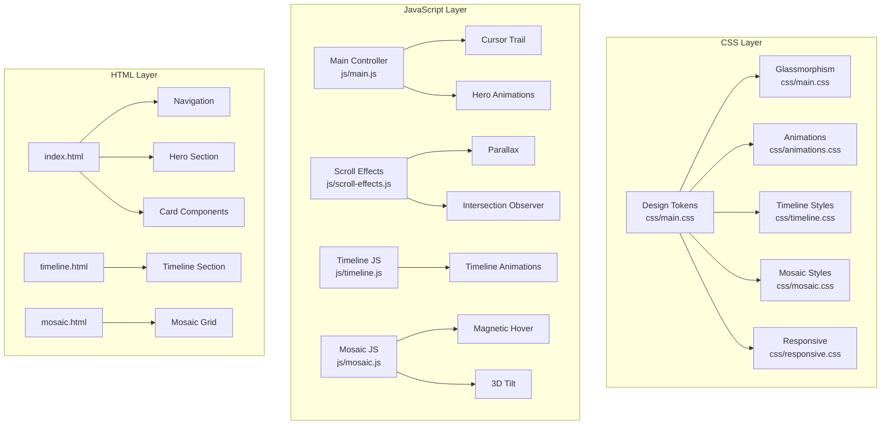
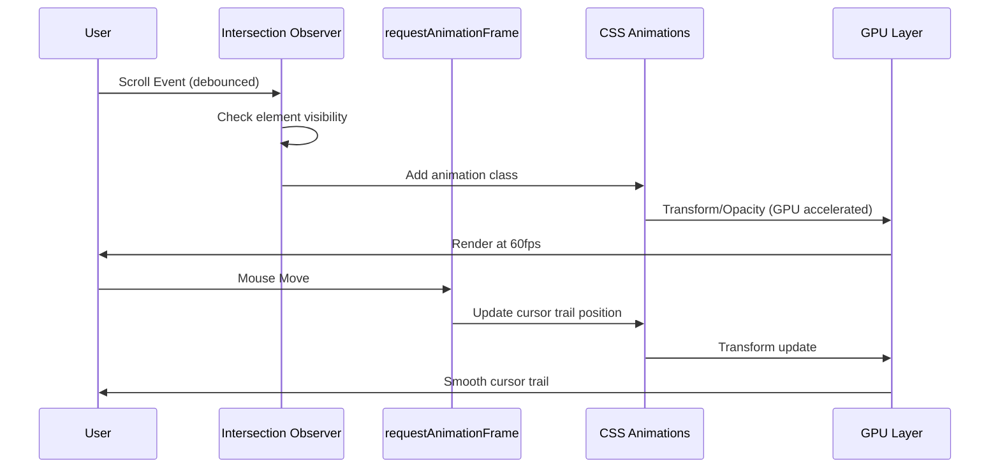

# Design Document: Premium UI Redesign

## Overview

This design document outlines the technical architecture and implementation approach for transforming the Vietnam Religious Diversity website into a contemporary premium design. The redesign introduces a dark theme with glassmorphism effects, animated gradients, and sophisticated interactions while maintaining performance and accessibility standards.

The implementation follows a progressive enhancement approach, modifying existing CSS and JavaScript files rather than replacing them entirely. This ensures backward compatibility and allows for incremental testing.

## Architecture

### High-Level Architecture



### Animation Pipeline



## Components and Interfaces

### 1. Design Token System (CSS Custom Properties)

```css
:root {
  /* Dark Theme Colors */
  --premium-bg-primary: #0f0f23;
  --premium-bg-secondary: #1a1a2e;
  --premium-bg-tertiary: #16213e;
  
  /* Gradient Colors */
  --gradient-primary-start: #667eea;
  --gradient-primary-mid: #764ba2;
  --gradient-primary-end: #f093fb;
  --gradient-sunset-start: #fa709a;
  --gradient-sunset-end: #fee140;
  --gradient-ocean-start: #4facfe;
  --gradient-ocean-end: #00f2fe;
  
  /* Accent Colors */
  --accent-purple: #b57bee;
  --accent-pink: #ff6ec7;
  --accent-blue: #4cc9f0;
  --accent-yellow: #ffd60a;
  
  /* Glass Effects */
  --glass-bg: rgba(255, 255, 255, 0.05);
  --glass-bg-hover: rgba(255, 255, 255, 0.1);
  --glass-border: rgba(255, 255, 255, 0.1);
  --glass-blur: 20px;
  
  /* Typography */
  --font-display: 'Space Grotesk', sans-serif;
  --font-body: 'Inter', sans-serif;
  --font-mono: 'JetBrains Mono', monospace;
}
```

### 2. Navigation Component

```javascript
interface NavigationController {
  init(): void;
  toggleMobileMenu(): void;
  handleScroll(): void;
  updateGlassEffect(scrollY: number): void;
}
```

### 3. Hero Section Component

```javascript
interface HeroController {
  init(): void;
  createGradientOrbs(): void;
  createParticles(): void;
  animateGradientText(): void;
}
```

### 4. Card Controller (3D Tilt)

```javascript
interface CardController {
  init(element: HTMLElement): void;
  handleMouseMove(event: MouseEvent): void;
  apply3DTilt(x: number, y: number): void;
  resetTilt(): void;
}
```

### 5. Cursor Trail Controller

```javascript
interface CursorTrailController {
  init(): void;
  handleMouseMove(event: MouseEvent): void;
  updateTrailPosition(x: number, y: number): void;
  isEnabled(): boolean;
}
```

### 6. Scroll Animation Controller

```javascript
interface ScrollAnimationController {
  init(): void;
  setupIntersectionObserver(): void;
  handleIntersection(entries: IntersectionObserverEntry[]): void;
  applyStaggerAnimation(elements: HTMLElement[]): void;
  handleParallax(scrollY: number): void;
}
```

### 7. Mosaic Controller (Magnetic Hover)

```javascript
interface MosaicController {
  init(): void;
  setupMagneticHover(card: HTMLElement): void;
  applyMagneticEffect(card: HTMLElement, dx: number, dy: number): void;
  resetCard(card: HTMLElement): void;
}
```

## Data Models

### Animation Configuration

```typescript
interface AnimationConfig {
  duration: number;
  delay: number;
  easing: string;
  threshold: number;
  staggerDelay: number;
}

interface TiltConfig {
  maxTilt: number;
  perspective: number;
  scale: number;
}

interface CursorTrailConfig {
  trailLength: number;
  fadeSpeed: number;
  size: number;
}
```

## Correctness Properties

*A property is a characteristic or behavior that should hold true across all valid executions of a system—essentially, a formal statement about what the system should do.*

### Property 1: Color Contrast Compliance

*For any* text element in the Premium_UI, the contrast ratio between the text color and its background color SHALL be at least 4.5:1 (WCAG 2.1 AA standard).

**Validates: Requirements 1.7, 14.1**

### Property 2: Heading Typography Consistency

*For any* heading element (h1-h6) in the Premium_UI, the computed font-family SHALL include 'Space Grotesk'.

**Validates: Requirements 2.1**

### Property 3: Body Typography Consistency

*For any* body text element (p, span, li) in the Premium_UI, the computed font-family SHALL include 'Inter'.

**Validates: Requirements 2.2**

### Property 4: Navigation Scroll State Transition

*For any* scroll position greater than 0, the navigation element SHALL have the 'scrolled' class applied, and for scroll position equal to 0, the 'scrolled' class SHALL be removed.

**Validates: Requirements 3.4**

### Property 5: Card 3D Tilt Response

*For any* cursor position (x, y) within a card element, the card's CSS transform SHALL reflect a rotation proportional to the cursor's offset from the card center, with maximum tilt angle not exceeding 15 degrees.

**Validates: Requirements 5.4**

### Property 6: Touch Target Minimum Size

*For any* interactive element (button, link, input) in the Premium_UI, the element's computed width and height SHALL both be at least 44 pixels.

**Validates: Requirements 6.5, 12.4**

### Property 7: Cursor Trail Position Tracking

*For any* mouse movement event at position (x, y), the cursor trail elements SHALL update their positions to follow the cursor with a smooth delay.

**Validates: Requirements 7.1**

### Property 8: Scroll Animation Viewport Reveal

*For any* element with the 'animate-on-scroll' class, when the element enters the viewport (intersection ratio > 0.1), the element SHALL receive the 'is-visible' class.

**Validates: Requirements 8.1, 9.2, 9.3, 9.5**

### Property 9: Stagger Animation Delay Increment

*For any* group of elements with stagger animation, each subsequent element SHALL have an animation-delay that is exactly 100ms greater than the previous element.

**Validates: Requirements 8.2**

### Property 10: Parallax Scroll Proportionality

*For any* element with parallax effect and any scroll position Y, the element's translateY value SHALL equal Y multiplied by the parallax speed factor.

**Validates: Requirements 8.4**

### Property 11: Reduced Motion Preference Compliance

*For any* animation in the Premium_UI, when prefers-reduced-motion: reduce is enabled, the animation-duration SHALL be 0s or the animation SHALL be disabled.

**Validates: Requirements 8.5, 11.4, 14.3**

### Property 12: Magnetic Hover Effect

*For any* mosaic card and cursor position within magnetic range (50px), the card's transform SHALL include a translation toward the cursor proportional to the distance.

**Validates: Requirements 10.2**

### Property 13: Responsive Grid Spacing Consistency

*For any* viewport width between 320px and 2560px, the mosaic grid cards SHALL maintain consistent gap spacing as defined by the design tokens.

**Validates: Requirements 10.6, 12.1**

### Property 14: Typography Responsive Scaling

*For any* viewport width, the hero title font-size SHALL scale proportionally using clamp() with minimum 2rem and maximum 6rem.

**Validates: Requirements 12.5**

### Property 15: Animation Performance (60fps)

*For any* animation frame during scroll, cursor movement, or element transitions, the frame time SHALL not exceed 16.67ms.

**Validates: Requirements 4.6, 7.6, 8.6, 9.6, 13.1**

### Property 16: GPU-Accelerated Animation Properties

*For any* animated element, the animation SHALL only modify transform and/or opacity properties.

**Validates: Requirements 13.2**

### Property 17: Image Lazy Loading

*For any* image element below the fold, the element SHALL have the loading="lazy" attribute.

**Validates: Requirements 13.6**

### Property 18: Focus Indicator Visibility

*For any* interactive element, when focused, it SHALL display a visible focus indicator with sufficient contrast.

**Validates: Requirements 6.6, 14.2**

### Property 19: Keyboard Navigation Accessibility

*For any* interactive element, the element SHALL be reachable via Tab key navigation.

**Validates: Requirements 14.4**

### Property 20: Heading Hierarchy Integrity

*For any* page, heading levels SHALL be sequential without skipping levels.

**Validates: Requirements 14.5**

### Property 21: ARIA Label Completeness

*For any* interactive element without visible text content, the element SHALL have an aria-label attribute.

**Validates: Requirements 14.6**

## Error Handling

### CSS Fallbacks

1. **Backdrop Filter Fallback**: Provide solid background for browsers without backdrop-filter support
2. **Font Fallback Chain**: Use system fonts as fallbacks for custom fonts
3. **CSS Custom Properties Fallback**: Provide fallback values for older browsers

### JavaScript Error Handling

1. **Feature Detection**: Check for IntersectionObserver, requestAnimationFrame support
2. **Touch Device Detection**: Disable cursor effects on touch devices
3. **Reduced Motion Detection**: Respect user preference for reduced motion

## Testing Strategy

### Unit Tests

- Design token validation
- Component render tests
- Edge case handling

### Property-Based Tests

Using fast-check library with minimum 100 iterations per test:

1. **Visual Properties**: Color contrast, typography consistency
2. **Interaction Properties**: Card tilt, cursor trail, magnetic hover
3. **Animation Properties**: Scroll reveal, stagger delays, parallax
4. **Responsive Properties**: Touch targets, grid spacing, typography scaling
5. **Accessibility Properties**: Reduced motion, keyboard navigation, heading hierarchy

### Performance Tests

- Animation frame rate monitoring (target: 60fps)
- Load time metrics (FCP < 1.5s, LCP < 2.5s)
- Memory usage monitoring
