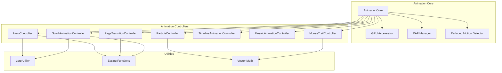

# Design Document: Ultimate UI Animations

## Overview

Thiết kế hệ thống animations cinematic cho website landing page về đa dạng tôn giáo Việt Nam. Hệ thống sử dụng kiến trúc modular với các animation controllers độc lập, tất cả đều tuân thủ nguyên tắc GPU acceleration và performance-first.

### Mục tiêu thiết kế
- Animations mượt mà 120fps trên mọi thiết bị
- Modular architecture cho dễ maintain và extend
- Full accessibility support với prefers-reduced-motion
- Progressive enhancement - website vẫn hoạt động khi JS disabled

### Tech Stack
- Vanilla JavaScript (ES6+) - không dependencies
- CSS Custom Properties (@property) cho advanced animations
- Canvas API cho mesh gradient
- IntersectionObserver API cho scroll animations
- requestAnimationFrame cho smooth animations

## Architecture



### File Structure

```
js/
├── animations/
│   ├── core/
│   │   ├── animation-core.js      # Base animation system
│   │   ├── gpu-accelerator.js     # GPU optimization utilities
│   │   └── reduced-motion.js      # Accessibility handler
│   ├── controllers/
│   │   ├── hero-controller.js     # Hero section animations
│   │   ├── particle-controller.js # 3D particle system
│   │   ├── page-transition.js     # Page transition effects
│   │   ├── scroll-animation.js    # Scroll-triggered animations
│   │   ├── timeline-animation.js  # Timeline page animations
│   │   ├── mosaic-animation.js    # Mosaic page animations
│   │   └── mouse-trail.js         # Mouse trail effect
│   └── utils/
│       ├── lerp.js                # Linear interpolation
│       ├── easing.js              # Easing functions
│       └── vector.js              # Vector math utilities
├── cinematic-animations.js        # Main entry point
css/
├── animations/
│   ├── cinematic-base.css         # Base animation styles
│   ├── hero-animations.css        # Hero section styles
│   ├── page-transitions.css       # Transition overlays
│   ├── scroll-reveals.css         # Scroll animation styles
│   ├── timeline-animations.css    # Timeline styles
│   └── mosaic-animations.css      # Mosaic styles
```

## Components and Interfaces

### 1. AnimationCore

Central manager cho tất cả animations.

```javascript
/**
 * AnimationCore - Central animation manager
 * Manages RAF loop, reduced motion, and controller lifecycle
 */
class AnimationCore {
    constructor() {
        this.controllers = new Map();
        this.isReducedMotion = false;
        this.rafId = null;
        this.isRunning = false;
    }
    
    // Register a controller
    register(name, controller) {}
    
    // Unregister a controller
    unregister(name) {}
    
    // Start animation loop
    start() {}
    
    // Stop animation loop
    stop() {}
    
    // Main animation loop
    tick(timestamp) {}
    
    // Check reduced motion preference
    checkReducedMotion() {}
    
    // Cleanup all controllers
    destroy() {}
}
```

### 2. GPUAccelerator

Utility class cho GPU optimization.

```javascript
/**
 * GPUAccelerator - GPU optimization utilities
 * Applies hardware acceleration to elements
 */
class GPUAccelerator {
    // Apply GPU acceleration to element
    static accelerate(element) {
        element.style.transform = 'translateZ(0)';
        element.style.backfaceVisibility = 'hidden';
        element.style.perspective = '1000px';
    }
    
    // Set will-change property
    static setWillChange(element, properties) {}
    
    // Clear will-change (for cleanup)
    static clearWillChange(element) {}
    
    // Check if property is GPU-accelerated
    static isGPUProperty(property) {}
}
```

### 3. HeroController

Quản lý hero section animations.

```javascript
/**
 * HeroController - Hero section animation manager
 * Handles mesh gradient, particles, text reveal, magnetic buttons
 */
class HeroController {
    constructor(container) {
        this.container = container;
        this.meshGradient = null;
        this.particleSystem = null;
        this.textReveal = null;
        this.magneticButtons = [];
    }
    
    // Initialize all hero animations
    init() {}
    
    // Update loop (called by AnimationCore)
    update(deltaTime) {}
    
    // Cleanup
    destroy() {}
}
```

### 4. MeshGradient

Canvas-based animated gradient background.

```javascript
/**
 * MeshGradient - Animated mesh gradient using Canvas
 * Creates smooth, flowing gradient background
 */
class MeshGradient {
    constructor(canvas) {
        this.canvas = canvas;
        this.ctx = canvas.getContext('2d', { alpha: false });
        this.points = [];
        this.colors = [
            { r: 102, g: 126, b: 234 },  // Primary blue
            { r: 118, g: 75, b: 162 },   // Purple
            { r: 240, g: 147, b: 251 },  // Pink
            { r: 250, g: 112, b: 154 }   // Coral
        ];
    }
    
    // Initialize gradient points
    initPoints(count = 5) {}
    
    // Update point positions
    update() {}
    
    // Render gradient
    render() {}
    
    // Handle resize
    resize() {}
}
```

### 5. ParticleSystem

3D particle system với physics.

```javascript
/**
 * ParticleSystem - 3D floating particles with physics
 * Responds to mouse movement
 */
class ParticleSystem {
    constructor(container, options = {}) {
        this.container = container;
        this.particles = [];
        this.mouse = { x: 0, y: 0 };
        this.options = {
            count: options.count || 100,
            minSize: options.minSize || 2,
            maxSize: options.maxSize || 6,
            maxDepth: options.maxDepth || 1000,
            mouseInfluence: options.mouseInfluence || 0.1
        };
    }
    
    // Create particles
    init() {}
    
    // Update particle positions
    update() {}
    
    // Handle mouse movement
    onMouseMove(x, y) {}
    
    // Cleanup
    destroy() {}
}
```

### 6. TextReveal

Glitch-to-solid text animation.

```javascript
/**
 * TextReveal - Character-by-character text reveal
 * Creates "glitch to solid" effect
 */
class TextReveal {
    constructor(element, options = {}) {
        this.element = element;
        this.text = element.textContent;
        this.chars = [];
        this.options = {
            staggerDelay: options.staggerDelay || 50,
            duration: options.duration || 800,
            easing: options.easing || 'cubic-bezier(0.4, 0, 0.2, 1)'
        };
    }
    
    // Split text into characters
    splitText() {}
    
    // Animate reveal
    reveal() {}
    
    // Reset to initial state
    reset() {}
}
```

### 7. MagneticButton

Magnetic hover effect cho buttons.

```javascript
/**
 * MagneticButton - Magnetic hover effect
 * Button follows cursor within bounds
 */
class MagneticButton {
    constructor(element, options = {}) {
        this.element = element;
        this.bounds = null;
        this.options = {
            strength: options.strength || 0.3,
            scale: options.scale || 1.1
        };
    }
    
    // Bind events
    bind() {}
    
    // Handle mouse move
    onMouseMove(e) {}
    
    // Handle mouse leave
    onMouseLeave() {}
    
    // Cleanup
    destroy() {}
}
```

### 8. PageTransitionController

Page transition effects.

```javascript
/**
 * PageTransitionController - Page transition manager
 * Handles liquid wipe and curtain reveal transitions
 */
class PageTransitionController {
    constructor(options = {}) {
        this.overlay = null;
        this.type = options.type || 'liquid'; // 'liquid' | 'curtain'
        this.duration = options.duration || 800;
        this.easing = options.easing || 'cubic-bezier(0.77, 0, 0.175, 1)';
    }
    
    // Create overlay element
    createOverlay() {}
    
    // Bind link click events
    bindLinks() {}
    
    // Execute transition
    transition(url) {}
    
    // Liquid wipe animation
    liquidWipe() {}
    
    // Curtain reveal animation
    curtainReveal() {}
}
```

### 9. ScrollAnimationController (Enhanced)

Enhanced scroll animations với Lerp.

```javascript
/**
 * ScrollAnimationController - Enhanced scroll animations
 * Uses Lerp for smooth parallax and IntersectionObserver for reveals
 */
class ScrollAnimationController {
    constructor() {
        this.scrollY = 0;
        this.currentY = 0;
        this.ease = 0.1;
        this.parallaxElements = [];
        this.revealObserver = null;
    }
    
    // Initialize
    init() {}
    
    // Lerp function
    lerp(start, end, factor) {}
    
    // Update parallax positions
    updateParallax() {}
    
    // Handle reveal intersection
    handleReveal(entries) {}
    
    // Apply reveal animation based on type
    applyReveal(element, type, ratio) {}
}
```

### 10. TimelineAnimationController

Timeline page animations.

```javascript
/**
 * TimelineAnimationController - Timeline page animations
 * Handles SVG progress line and node animations
 */
class TimelineAnimationController {
    constructor(container) {
        this.container = container;
        this.path = null;
        this.pathLength = 0;
        this.nodes = [];
        this.items = [];
    }
    
    // Initialize
    init() {}
    
    // Update on scroll
    update() {}
    
    // Animate progress line
    animateProgressLine(progress) {}
    
    // Animate timeline items
    animateItems(progress) {}
    
    // Activate node
    activateNode(node) {}
}
```

### 11. MosaicAnimationController

Mosaic page animations.

```javascript
/**
 * MosaicAnimationController - Mosaic grid animations
 * Handles 3D tilt, neighbor push, gradient borders
 */
class MosaicAnimationController {
    constructor(container) {
        this.container = container;
        this.tiles = [];
        this.activeTile = null;
    }
    
    // Initialize
    init() {}
    
    // Bind tile events
    bindTile(tile) {}
    
    // Apply 3D tilt effect
    applyTilt(tile, mouseX, mouseY) {}
    
    // Push neighboring tiles
    pushNeighbors(activeTile) {}
    
    // Reset neighbors
    resetNeighbors() {}
    
    // Update floating animation
    updateFloating(timestamp) {}
}
```

### 12. MouseTrailController

Mouse trail particle effect.

```javascript
/**
 * MouseTrailController - Mouse trail with particles
 * Creates colorful particle trail following cursor
 */
class MouseTrailController {
    constructor(options = {}) {
        this.particles = [];
        this.hue = 0;
        this.options = {
            maxParticles: options.maxParticles || 30,
            minSize: options.minSize || 5,
            maxSize: options.maxSize || 15,
            decay: options.decay || 0.02
        };
    }
    
    // Bind mouse events
    bind() {}
    
    // Add particle at position
    addParticle(x, y) {}
    
    // Update particles
    update() {}
    
    // Cleanup
    destroy() {}
}
```

## Data Models

### AnimationConfig

```typescript
interface AnimationConfig {
    // Global settings
    targetFPS: number;           // Target FPS (default: 120)
    reducedMotion: boolean;      // Reduced motion preference
    
    // Hero settings
    hero: {
        meshGradient: {
            pointCount: number;  // Number of gradient points
            colors: Color[];     // Gradient colors
            speed: number;       // Movement speed
        };
        particles: {
            count: number;       // Particle count
            minSize: number;     // Min particle size
            maxSize: number;     // Max particle size
            maxDepth: number;    // Max Z depth
            mouseInfluence: number; // Mouse influence factor
        };
        textReveal: {
            staggerDelay: number; // Delay between chars (ms)
            duration: number;     // Animation duration (ms)
        };
        magneticButton: {
            strength: number;    // Magnetic strength (0-1)
            scale: number;       // Hover scale factor
        };
    };
    
    // Page transition settings
    pageTransition: {
        type: 'liquid' | 'curtain';
        duration: number;        // Transition duration (ms)
        easing: string;          // CSS easing function
    };
    
    // Scroll animation settings
    scroll: {
        lerpEase: number;        // Lerp smoothing factor
        parallaxSpeed: number;   // Default parallax speed
        revealThresholds: number[]; // IntersectionObserver thresholds
    };
    
    // Timeline settings
    timeline: {
        nodeRippleDuration: number; // Ripple animation duration
        itemStagger: number;     // Item stagger delay
    };
    
    // Mosaic settings
    mosaic: {
        tiltMaxAngle: number;    // Max tilt angle (degrees)
        pushForce: number;       // Neighbor push force
        pushRadius: number;      // Push effect radius
        floatAmplitude: number;  // Float animation amplitude
    };
    
    // Mouse trail settings
    mouseTrail: {
        maxParticles: number;    // Max trail particles
        decay: number;           // Particle life decay rate
    };
}
```

### Particle

```typescript
interface Particle {
    element: HTMLElement;
    x: number;
    y: number;
    z: number;
    vx: number;              // Velocity X
    vy: number;              // Velocity Y
    vz: number;              // Velocity Z
    size: number;
    opacity: number;
    life: number;            // For trail particles
}
```

### GradientPoint

```typescript
interface GradientPoint {
    x: number;
    y: number;
    vx: number;              // Velocity X
    vy: number;              // Velocity Y
    radius: number;
    color: Color;
}

interface Color {
    r: number;
    g: number;
    b: number;
}
```

### RevealConfig

```typescript
interface RevealConfig {
    type: 'fade-up' | 'scale' | 'rotate' | 'slide-left' | 'slide-right';
    threshold: number;
    rootMargin: string;
    duration: number;
    easing: string;
}
```

### TimelineItem

```typescript
interface TimelineItem {
    element: HTMLElement;
    node: HTMLElement;
    index: number;
    isLeft: boolean;         // Alternating position
    isVisible: boolean;
    progress: number;        // Animation progress (0-1)
}
```

### MosaicTile

```typescript
interface MosaicTile {
    element: HTMLElement;
    bounds: DOMRect;
    isHovering: boolean;
    floatOffset: number;     // For floating animation
    tiltX: number;
    tiltY: number;
}
```


## Correctness Properties

*A property is a characteristic or behavior that should hold true across all valid executions of a system-essentially, a formal statement about what the system should do. Properties serve as the bridge between human-readable specifications and machine-verifiable correctness guarantees.*

### Property 1: GPU-Only Properties

*For any* animation configuration, all CSS properties used in animations SHALL only be from the GPU-accelerated set: transform, opacity, filter, backdrop-filter. No forbidden properties (top, left, width, height, margin, padding) SHALL be present.

**Validates: Requirements 1.1, 1.5**

### Property 2: Hardware Acceleration Application

*For any* element passed to GPUAccelerator.accelerate(), the element SHALL have translateZ(0), backface-visibility: hidden, and perspective: 1000px applied to its style.

**Validates: Requirements 1.2, 1.3**

### Property 3: Mesh Gradient Point Count Invariant

*For any* MeshGradient instance, the number of gradient points SHALL always be >= 4.

**Validates: Requirements 2.2**

### Property 4: Mesh Gradient Bounce Physics

*For any* gradient point that reaches the canvas edge (x <= 0, x >= width, y <= 0, y >= height), the corresponding velocity component (vx or vy) SHALL be negated (multiplied by -1).

**Validates: Requirements 2.3**

### Property 5: Particle Mouse Response

*For any* mouse position change, all particles in the ParticleSystem SHALL have their positions influenced by the mouse coordinates proportional to the mouseInfluence factor.

**Validates: Requirements 2.5**

### Property 6: Particle Count Invariant

*For any* ParticleSystem instance on desktop (viewport >= 768px), the particle count SHALL be >= 50. On mobile (viewport < 768px), the particle count SHALL be >= 30.

**Validates: Requirements 2.6, 10.1**

### Property 7: Text Reveal Stagger Timing

*For any* TextReveal animation with N characters, character at index i SHALL have animation delay of i * staggerDelay milliseconds.

**Validates: Requirements 2.8**

### Property 8: Page Transition Configuration

*For any* PageTransitionController instance, the duration SHALL be 800ms and easing SHALL be 'cubic-bezier(0.77, 0, 0.175, 1)'.

**Validates: Requirements 3.2**

### Property 9: Lerp Calculation Correctness

*For any* start value, end value, and factor (0 <= factor <= 1), lerp(start, end, factor) SHALL return start + (end - start) * factor.

**Validates: Requirements 4.1**

### Property 10: Parallax Effect Application

*For any* element with data-parallax attribute and any scroll position, the element's transform SHALL be translate3d(0, -scrollY * parallaxSpeed, 0).

**Validates: Requirements 4.2**

### Property 11: Scroll Reveal Comprehensive

*For any* element with data-reveal attribute entering the viewport with intersectionRatio r:
- fade-up: opacity = r, translateY = (1-r) * 50px
- scale: opacity = r, scale = 0.8 + r * 0.2
- rotate: opacity = r, rotate3d = (1-r) * 45deg
- slide-left: opacity = r, translateX = (1-r) * -100px
- slide-right: opacity = r, translateX = (1-r) * 100px

**Validates: Requirements 4.4, 4.5, 4.6**

### Property 12: Timeline Progress Line

*For any* scroll position resulting in progress p (0 <= p <= 1), the SVG path's stroke-dashoffset SHALL be pathLength - (pathLength * p).

**Validates: Requirements 5.2**

### Property 13: Timeline Items Animation

*For any* timeline item at index i with progress p:
- Item SHALL have opacity = p
- Item at even index SHALL have rotateY with negative angle
- Item at odd index SHALL have rotateY with positive angle
- When p > 0.8, item SHALL have 'fully-visible' class

**Validates: Requirements 5.4, 5.5, 5.6**

### Property 14: Mosaic 3D Tilt Calculation

*For any* mosaic tile with mouse at position (mx, my) relative to tile center (cx, cy):
- rotateX SHALL be proportional to (my - cy) / tileHeight
- rotateY SHALL be proportional to (cx - mx) / tileWidth
- Both rotations SHALL be clamped to maxTiltAngle

**Validates: Requirements 6.1, 6.2**

### Property 15: Mosaic Neighbor Push

*For any* hovered tile and any neighboring tile within pushRadius distance d:
- Push force SHALL be proportional to (1 - d/pushRadius)
- Push direction SHALL be away from the hovered tile center
- Tiles outside pushRadius SHALL not be affected

**Validates: Requirements 6.3**

### Property 16: Mosaic Inner Glow Position

*For any* mouse position (x, y) on a mosaic tile, the CSS custom properties --mouse-x and --mouse-y SHALL be set to (x/width)*100% and (y/height)*100% respectively.

**Validates: Requirements 6.6**

### Property 17: Mosaic Floating Animation

*For any* non-hovered mosaic tile at timestamp t with index i:
- floatY SHALL be sin(t + i * offset) * amplitude
- floatRotate SHALL be sin(t * 0.5 + i * offset) * rotateAmplitude

**Validates: Requirements 6.7**

### Property 18: Mouse Trail Lifecycle

*For any* MouseTrailController:
- Adding a particle when count >= maxParticles SHALL remove the oldest particle first
- Each update SHALL decrease particle.life by decay amount
- Particles with life <= 0 SHALL be removed from DOM and particles array

**Validates: Requirements 7.1, 7.2, 7.3, 7.4**

### Property 19: Animation Cleanup

*For any* animation controller, calling destroy() SHALL:
- Remove all event listeners
- Clear all animation frames
- Reset all element styles to initial state
- Set isInitialized to false

**Validates: Requirements 8.3**

### Property 20: Reduced Motion Comprehensive

*For any* system with prefers-reduced-motion: reduce:
- All continuous animations SHALL be disabled
- Content SHALL be visible immediately without animation delays
- ParticleSystem SHALL not create any particles
- MouseTrailController SHALL not add any trail particles

**Validates: Requirements 9.1, 9.2, 9.3, 9.4**

### Property 21: Touch Device Tilt Disable

*For any* touch device (detected via 'ontouchstart' in window or navigator.maxTouchPoints > 0), the MosaicAnimationController SHALL not apply 3D tilt effect on hover.

**Validates: Requirements 10.2**

### Property 22: Canvas Resize Handling

*For any* viewport resize event, all canvas elements SHALL have their width and height updated to match the new viewport/container dimensions.

**Validates: Requirements 10.4**

## Error Handling

### Animation Initialization Errors

| Error Condition | Handling Strategy |
|----------------|-------------------|
| Canvas context unavailable | Fallback to CSS gradient background |
| IntersectionObserver not supported | Apply fallback - show all elements immediately |
| requestAnimationFrame not available | Use setTimeout fallback with 16ms interval |
| Element not found | Log warning, skip animation for that element |

### Runtime Errors

| Error Condition | Handling Strategy |
|----------------|-------------------|
| Invalid animation config | Use default values, log warning |
| DOM element removed during animation | Check element existence before update, cleanup if removed |
| Performance degradation detected | Reduce particle count, disable non-essential effects |
| Memory leak detected | Force garbage collection, reset animation state |

### Graceful Degradation

```javascript
// Example: Graceful degradation for particle system
class ParticleSystem {
    init() {
        try {
            // Check for reduced motion
            if (this.isReducedMotion()) {
                console.log('ParticleSystem: Reduced motion enabled, skipping');
                return;
            }
            
            // Check for mobile - reduce particles
            if (window.innerWidth < 768) {
                this.options.count = Math.min(this.options.count, 30);
            }
            
            // Check for low-end device
            if (this.isLowEndDevice()) {
                this.options.count = Math.min(this.options.count, 20);
            }
            
            this.createParticles();
        } catch (error) {
            console.error('ParticleSystem init failed:', error);
            // Fallback: no particles, static background
        }
    }
}
```

## Testing Strategy

### Dual Testing Approach

Hệ thống sử dụng cả unit tests và property-based tests để đảm bảo correctness:

- **Unit tests**: Verify specific examples, edge cases, error conditions
- **Property tests**: Verify universal properties across all valid inputs

### Property-Based Testing Configuration

- **Library**: fast-check (đã có trong project)
- **Minimum iterations**: 100 per property test
- **Tag format**: `Feature: ultimate-ui-animations, Property {number}: {property_text}`

### Test Structure

```
tests/
├── unit/
│   ├── animation-core.test.js
│   ├── gpu-accelerator.test.js
│   ├── mesh-gradient.test.js
│   ├── particle-system.test.js
│   ├── text-reveal.test.js
│   ├── magnetic-button.test.js
│   ├── page-transition.test.js
│   ├── scroll-animation.test.js
│   ├── timeline-animation.test.js
│   ├── mosaic-animation.test.js
│   └── mouse-trail.test.js
├── property/
│   ├── gpu-properties.property.test.js
│   ├── mesh-gradient.property.test.js
│   ├── particle-system.property.test.js
│   ├── scroll-animation.property.test.js
│   ├── timeline-animation.property.test.js
│   ├── mosaic-animation.property.test.js
│   ├── mouse-trail.property.test.js
│   └── reduced-motion.property.test.js
└── integration/
    └── animation-system.integration.test.js
```

### Unit Test Examples

```javascript
// Unit test for specific edge case
describe('MeshGradient', () => {
    it('should bounce point when hitting left edge', () => {
        const gradient = new MeshGradient(canvas);
        const point = { x: 0, y: 100, vx: -5, vy: 2 };
        gradient.updatePoint(point);
        expect(point.vx).toBe(5); // Velocity reversed
    });
});
```

### Property Test Examples

```javascript
// Property test for lerp calculation
describe('Property 9: Lerp Calculation', () => {
    it('should correctly interpolate for all valid inputs', () => {
        fc.assert(
            fc.property(
                fc.float({ min: -1000, max: 1000 }),
                fc.float({ min: -1000, max: 1000 }),
                fc.float({ min: 0, max: 1 }),
                (start, end, factor) => {
                    const result = lerp(start, end, factor);
                    const expected = start + (end - start) * factor;
                    return Math.abs(result - expected) < 0.0001;
                }
            ),
            { numRuns: 100 }
        );
    });
});
// Feature: ultimate-ui-animations, Property 9: Lerp Calculation Correctness
```

### Integration Test Focus

- Animation system initialization và lifecycle
- Controller coordination
- Reduced motion preference handling
- Responsive behavior across viewport sizes
- Memory cleanup và performance
